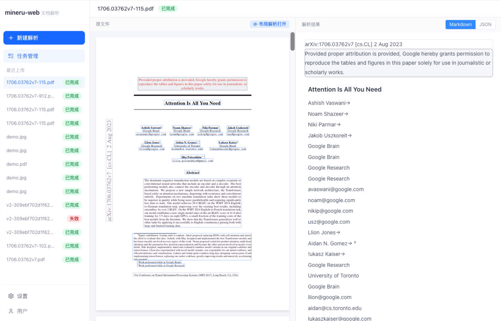

# MinerU Web Service

基于本地 [MinerU](https://github.com/opendatalab/MinerU) 服务的文档智能解析平台。React 前端 + 轻量 FastAPI 后端，解析能力完全由 MinerU 本地服务承载，自建后端只做元数据存储与文件代理。

最终效果图：


## 功能

- 上传 PDF / 图片文件，自动调用本地 MinerU 服务解析
- 左右双栏界面：左侧 PDF 原文渲染 + bbox 框选高亮，右侧解析内容
- 基于 `middle_json` 的精确 bbox 对齐（原生页面坐标系）
- 支持文本、标题、列表、公式、表格、图片等内容块的差异化渲染
- 页眉、页脚、旁注等边缘内容可隐藏/显示
- JSON 原始数据查看器（CodeMirror 6）

## 架构

```
用户浏览器
    │
    ▼
React 前端（开发：port 5173 / 生产：port 80）
    │  /api/* → 反向代理
    ▼
FastAPI 后端（port 8000）
    ├── SQLite（文件元数据 + 解析结果缓存）
    ├── MinIO（原文件对象存储，生成预签名 URL 供前端预览）
    │
    └── HTTP 调用
         ▼
    MinerU 本地服务（port 18000）
         ├── POST /file_parse        同步解析（阻塞等待结果）
         ├── POST /tasks             异步提交任务（立即返回 task_id）
         ├── GET  /tasks/{task_id}   查询任务状态
         └── GET  /docs              Swagger 文档
```

**存储职责：**

| 存储 | 存什么 | 用途 |
|------|--------|------|
| **MinIO** | 用户上传的原始文件（PDF / 图片） | 生成预签名 URL，供前端左侧 `react-pdf` / `` 渲染原文件 |
| **SQLite** | 文件元数据（filename、status、created_at 等） | 文件列表、历史记录、任务状态轮询 |
| **SQLite** | 解析结果（`md_content`、`content_list`、`middle_json`，序列化为 TEXT） | 避免重复调用 MinerU，前端直接从后端取缓存 |

**后端职责极简：**

| 职责 | MinerU 承担 | 自建后端承担 |
|------|------------|------------|
| 文件解析（版面分析、OCR、公式、表格） | ✅ | 转发请求 |
| 任务队列 | ✅ | ❌ |
| 解析结果（md / content_list / middle_json） | ✅ | 缓存到 SQLite |
| 原文件存储 + 预览 URL | ❌ | ✅ MinIO |
| 文件列表 / 历史记录 | ❌ | ✅ SQLite |

**MinerU 版本兼容：**

| 版本 | 接口 | 模式 | 说明 |
|------|------|------|------|
| 2.7.6 | `POST /file_parse` | 同步 | 阻塞等待 MinerU 返回完整结果，超时风险较高 |
| 3.0 | `POST /tasks` + 轮询 | 异步 | 立即返回 task_id，后台轮询状态直到完成再取结果 |

前端上传页可切换版本，两套流程对应不同后端接口（`/files/upload` vs `/files/upload_async`），解析完成后的查看体验完全一致。


## 环境依赖


| 依赖      | 版本    | 说明                 |
| ------- | ----- | ------------------ |
| Python  | 3.13+ | 后端运行环境             |
| uv      | 最新    | Python 包管理         |
| Node.js | 18+   | 前端构建               |
| pnpm    | 最新    | 前端包管理              |
| MinIO   | —     | 原文件对象存储            |
| MinerU  | —     | 本地解析服务（port 18000） |


## 快速启动

### 1. 启动 MinerU 本地服务

参考 [MinerU 官方文档](https://opendatalab.github.io/MinerU/zh/quick_start/docker_deployment/) 启动解析服务，确保 `http://localhost:18000/docs` 可访问。

```bash
# Docker 方式（推荐）
docker compose -f compose.yaml --profile api up -d

# 或源码方式
mineru-api
```

### 2. 启动 MinIO

```bash
docker run -d -p 9000:9000 -p 9001:9001 \
  -e MINIO_ROOT_USER=minioadmin \
  -e MINIO_ROOT_PASSWORD=minioadmin \
  quay.io/minio/minio server /data --console-address ":9001"
```

### 3. 启动后端

安装 uv（如未安装）：

```bash
# macOS / Linux
curl -LsSf https://astral.sh/uv/install.sh | sh

# 或通过 pip
pip install uv
```

```bash
cd backend

# 复制并编辑配置文件（所有配置项均在此文件中）
cp .env.example .env
# 按需修改 .env

# 安装依赖（自动创建虚拟环境）
uv sync

# 激活虚拟环境
source .venv/bin/activate  # macOS / Linux
# .venv\Scripts\activate   # Windows

# 启动（开发模式，支持热重载）
uv run fastapi dev main.py
```

配置项说明见 `backend/.env.example`，由 `app/config.py` 统一加载。优先级从高到低：**环境变量 > `.env` 文件 > `config.py` 默认值**。

**调试模式：** `app/services/mineru.py` 中有一段被注释的调试代码，启用后会将 MinerU 的原始响应完整写入 `backend/debug/` 目录（JSON 格式），便于排查解析问题。使用时取消注释即可，生产环境保持注释状态。

后端 API 文档：`http://localhost:8000/docs`

### 4. 启动前端

```bash
cd frontend

# 安装依赖
pnpm install

# 开发模式启动（自动代理 /api 到 localhost:8000）
pnpm run dev
```

访问：`http://localhost:5173`

## 项目结构

```
mineru-web-service/
├── backend/
│   ├── main.py                    # FastAPI 入口，CORS 配置
│   ├── pyproject.toml             # 依赖声明（uv）
│   ├── .env.example               # 配置模板（复制为 .env 后修改）
│   └── app/
│       ├── config.py              # 集中配置（pydantic-settings，读取 .env）
│       ├── database.py            # SQLite 连接与初始化
│       ├── models.py              # SQLAlchemy ORM 模型
│       ├── schemas.py             # Pydantic 请求/响应模型
│       ├── routers/
│       │   └── files.py           # 文件上传、查询、解析结果接口
│       └── services/
│           ├── mineru.py          # MinerU API 调用（含图片 base64 回填）
│           └── storage.py        # MinIO 文件存储
│
├── frontend/
│   ├── vite.config.ts             # Vite 配置（/api 反向代理）
│   ├── src/
│   │   ├── types.ts               # TypeScript 类型定义
│   │   ├── api/index.ts           # 后端 API 封装
│   │   ├── utils/
│   │   │   └── parseMiddleJson.ts # middle_json → ParsedBlock[] 解析器
│   │   ├── pages/
│   │   │   ├── HomePage.tsx       # 文件上传
│   │   │   ├── TaskListPage.tsx   # 历史记录列表
│   │   │   └── TaskDetailPage.tsx # 解析结果双栏查看器
│   │   └── components/
│   │       ├── PDFViewerV2.tsx    # PDF 渲染 + bbox 高亮（middle_json）
│   │       ├── ContentViewerV2.tsx# 内容块渲染（middle_json）
│   │       ├── ImageViewer.tsx    # 图片文件查看器（content_list）
│   │       ├── ContentViewer.tsx  # 图片文件内容渲染（content_list）
│   │       └── JsonViewer.tsx     # JSON 数据查看器（CodeMirror 6）
│   └── package.json
│
└── README.md
```

## 后端 API


| 方法 | 路径 | 说明 |
|------|------|------|
| `POST` | `/files/upload` | 上传并同步解析（MinerU 2.7.6，`POST /file_parse`） |
| `POST` | `/files/upload_async` | 上传并异步解析（MinerU 3.0，`POST /tasks` + 轮询） |
| `GET` | `/files` | 文件列表 |
| `GET` | `/files/{id}/result` | 文件详情 + 状态 |
| `GET` | `/files/{id}/content_list` | 解析结果（content_list 格式） |
| `GET` | `/files/{id}/middle_json` | 解析结果（middle_json 格式，含精确 bbox） |
| `GET` | `/files/{id}/download_url` | 原文件预签名下载 URL（MinIO 生成） |
| `GET` | `/files/{id}/mineru_status` | 查询 MinerU 异步任务原始状态（3.0 模式专用） |
| `DELETE` | `/files/{id}` | 删除记录及 MinIO 文件 |


## 技术栈

**前端**

- React 19 + TypeScript + Vite 8
- Tailwind CSS 4
- react-pdf（PDF 渲染）
- @uiw/react-codemirror（JSON 查看器）
- lucide-react（图标）

**后端**

- FastAPI + Uvicorn
- SQLAlchemy + SQLite
- MinIO Python SDK
- httpx（调用 MinerU）

## License

MIT